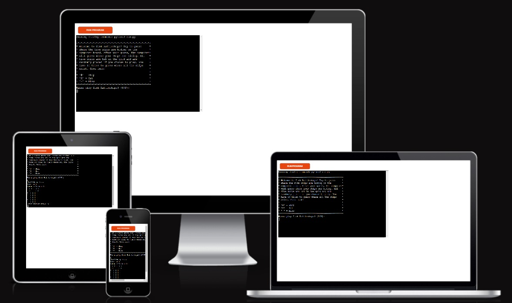
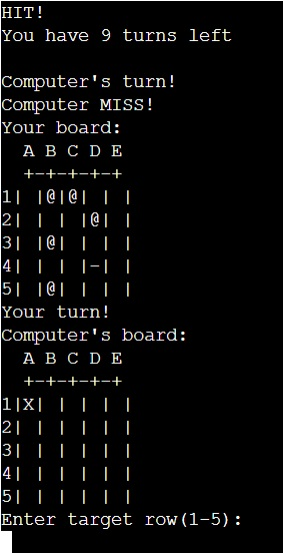
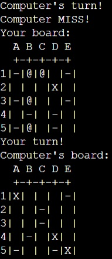
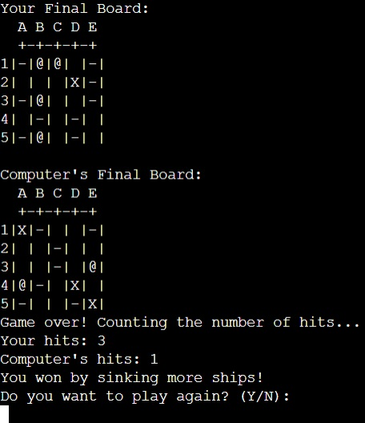
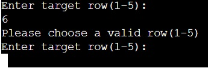
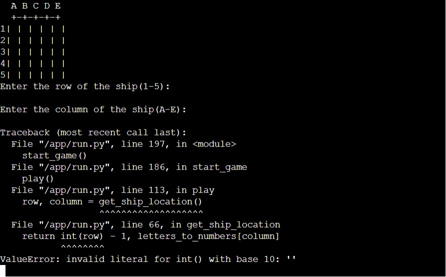
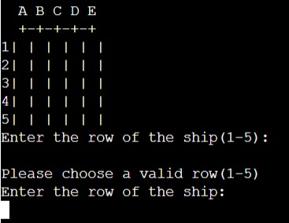

# Sink Battleships - Python Battleship Game

[The actual website](https://sink-battleships-0da166920aef.herokuapp.com/)

Welcome to Sink Battleships, a classic game created using Python. Try to guess where all the boats are hiding on the open sea!

## Content Index

- [Game Description](#game-description)
- [Features](#features)
- [Technologies Used](#technologies-used)
- [Testing](#testing)
- [Validator](#validator)
- [Bugs](#bugs)
- [Deployment](#deployment)
- [Credits](#credits)

## Game Description

Sink Battleships is a textual version of the classic Battleship game. Players alternate turns with the computer, aiming to tactically locate and destroy the opponent's ships on a 5x5 grid. The user and the computer have 10 rounds each to try to sink all the ships. This game offers an easy and fun method to test your strategic skills and fortune against an artificial intelligence adversary.

If you've never played Battleship before, here's a description:
[Wikipedia](https://en.wikipedia.org/wiki/Battleship_(game))

## Features

### Start The Game
- Before the game starts, a message appears asking if the user wants to play. Here the user can choose yes or no.

### Boards
- When the game starts, it is the user who starts selecting coordinates on the computers board. The user sees the board as a grid of cells and now has the option to first select a row (1-5) and then a column (A-E).
- After the player has made his choices, the application tells if there was a miss or a hit, as well as how many rounds the player has left. Then the user's board appears and the computer makes a randomized guess. The text below the user's board reveals if the computer had a miss or a hit. Then it's the user's turn again.

    

### Indicators
- During the game, the boards are updated according to the guesses that are made. If someone hits a ship this is shown as an "X" on the board and if they miss this is shown as a "-".

### Game Over
- When all 10 rounds are completed, the application says the game is over. Number of hits is counted and the winner is announced. If user and computer hit the same number of ships, it will be a tie.
- The user is then asked if they want to play again.

### Wrong Inputs
- If the user enters blank or incorrect data at the start of the game, a message appears and the game will prompt the user to re-enter a valid input.

- If the user enters blank or incorrect data when a row is to be selected, a message appears and the game will prompt the user to re-enter a valid input.

- If the user enters blank or incorrect data when a column is to be selected, a message appears and the game will prompt the user to re-enter a valid input.

### Future Features

- There are many things that could improve the game experience, such as different types of boats with different sizes, the size of the board, number of turns, etc.

## Technologies Used

### Languages Used

- [Python](https://www.python.org/)  -  The programming language used for game development.

### Frameworks, Libraries & Programs Used

- GitPod
- [GitHub](https://github.com/)
- [Heroku](https://www.heroku.com/home)
- `from random import randint` - This Python library was used for random number tasks.

## Testing

- All the features mentioned above have been manually tested and work without hindrance.

## Validator

- Only one error message appeared when the code was tested through the [Pep8 Validator](https://pep8ci.herokuapp.com/). The code on this line is considered too long. However, this code is not visible in the terminal, so I assumed there should be no problem.

## Bugs

- **Bug:** Handle empty input
    - **Description:** When the user would enter data for row and column and instead only pressed enter (ie empty input), the game crashed.
    - **Solution:** By adding "not row/column or" within the respective "while-loop" under the "get_ship_location" function, instead the same error message came up as when the wrong input was made.

Before:

After:

## Deployment

This project was deployed using Code Institute's mock terminal for Heroku.

- Steps for deployment:
    - Create an account on Heroku
    - Create a new Heroku app
    - In the new app, go to settings and add a Config var with the key: PORT and the value: 8000
    - Set the buildpacks to Python and NodeJS in that order
    - Then you go under the "Deploy" tab, select "GitHub" as "Deployment method", search for the name of your repository and press connect
    - Next I selected "Enable Automatic Deploys"

## Credits

### Code

- The structure of the application is taken from a [YouTube tutorial](https://www.youtube.com/watch?v=tF1WRCrd_HQ). After the structure was set, with the help of the tutorial, I updated the code and gave the game more and better features.
- These two PP3 projects have been used as a source of inspiration for the development of this app: [Battleship Game](https://battleshipv2-8b5e10507413.herokuapp.com/), [Battle at Sea](https://pp3-battle-at-sea-a1894ff02de5.herokuapp.com/)
- These websites have been used to find solutions to problems encountered during the development of the app: [W3Schools](https://www.w3schools.com/), [GeeksforGeeks](https://www.geeksforgeeks.org/) and [Online Python Tutor](https://pythontutor.com/).
- I also looked at various Python lessons within the Code Institute's LMS.
- Wikipedia reference for how to play the game.